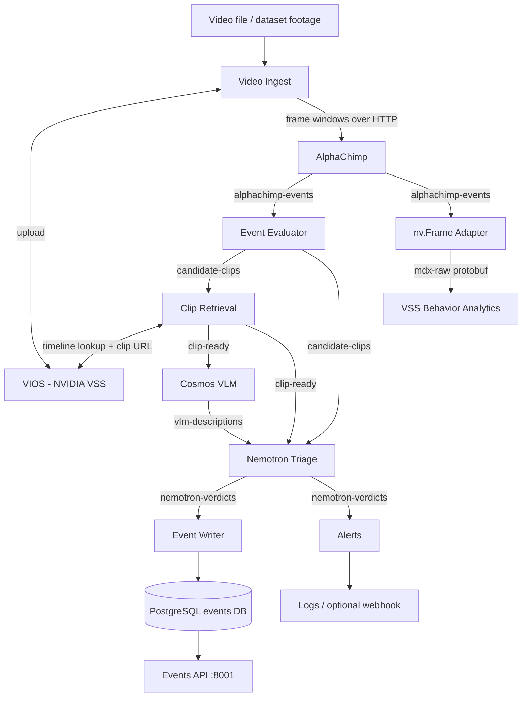

# Primate Event Intelligence on NVIDIA DGX Spark

**Hackathon repository:** https://github.com/tristanpalmer07/Sparkathon

Primate Event Intelligence is an event-driven video understanding pipeline for chimpanzee monitoring. It combines a domain-specific perception model (**AlphaChimp**) with NVIDIA video infrastructure and reasoning models to turn raw footage into structured, reviewable events.

The core idea is simple:

> **AlphaChimp sees → deterministic rules decide what is interesting → NVIDIA Cosmos describes the evidence → NVIDIA Nemotron judges the event → the result is stored, alerted, and exposed through an API.**

This keeps expensive VLM/LLM inference out of the always-on hot path while preserving an auditable chain from raw perception to final verdict.

---

## Demo highlights

- Chimp **detection, tracking, and 24-class behavior classification** with AlphaChimp.
- AlphaChimp ported to **ARM64 / NVIDIA DGX Spark / GB10** using a modern NVIDIA PyTorch container and source-built MMCV CUDA ops.
- Event-driven processing with deterministic temporal rules before VLM/LLM inference.
- **NVIDIA VSS Kafka** and **VIOS** for messaging and time-based video retrieval.
- AlphaChimp metadata converted to NVIDIA-native **`nv.Frame` protobuf** and published to `mdx-raw`.
- **NVIDIA Cosmos-Reason2-8B** for video description.
- **NVIDIA Nemotron Nano 9B v2 (DGX Spark variant)** for event reasoning and triage.
- Event persistence in PostgreSQL, optional webhook alerts, and a FastAPI Events API.
- End-to-end validation on chimp footage and synthetic trigger injection.

---

## Architecture



### System roles

| Layer | Component | Responsibility |
|---|---|---|
| Perception | **AlphaChimp** | Detect chimps, track identity, classify behaviors |
| Cheap triage | **Event Evaluator** | Stateful temporal rules; no LLM in the hot path |
| Video evidence | **VIOS + Clip Retrieval** | Store video and resolve the exact event window |
| Description | **Cosmos-Reason2-8B** | Describe what is visibly happening in the clip |
| Reasoning | **Nemotron Nano 9B v2** | Decide whether the trigger is credible/important |
| Persistence | **Event Writer + PostgreSQL** | Save every verdict for audit/query |
| Notification | **Alerts** | Notify only reportable medium/high-priority events |
| API | **Events API** | Query, filter, acknowledge, or dismiss events |
| NVIDIA interop | **nv.Frame Adapter** | Publish AlphaChimp metadata in VSS-native format |

---

## Tech stack

### Application

- Python
- FastAPI / Uvicorn
- PyTorch
- OpenCV
- OpenMMLab: MMEngine, MMDetection/MMTracking/MMAction-style components, MMCV
- Kafka
- PostgreSQL
- Pydantic
- Protobuf / gRPC tooling
- Docker / Docker Compose
- FFmpeg

### NVIDIA

- **NVIDIA DGX Spark** — GB10, ARM64/aarch64
- **NVIDIA VSS (Video Search & Summarization)** infrastructure
  - VIOS video ingest/storage
  - VSS Kafka
  - `nv.Frame` / `mdx-raw`
  - VSS Behavior Analytics
- **NVIDIA NIM**
  - `nvidia/cosmos-reason2-8b:1.6.0`
  - `nvidia-nemotron-nano-9b-v2-dgx-spark:1.0.0-variant`
- NVIDIA PyTorch NGC base image for AlphaChimp ARM64/Blackwell support

---

## Models

### AlphaChimp — perception

AlphaChimp performs:

- chimp detection,
- ByteTrack-style identity tracking,
- 24-class multi-label behavior classification.

The deployed checkpoint is `alphachimp_res576.pth`.

Behavior labels:

```text
other, moving, climbing, resting, sleeping, solitary object playing, eating,
manipulating object, grooming, being groomed, aggressing, embracing, begging,
being begged from, taking object, losing object, carrying, being carried,
nursing, being nursed, playing, touching, erection, displaying
```

AlphaChimp runs natively in PyTorch inside the `alphachimp` service. 

### Cosmos-Reason2-8B — evidence description

Cosmos receives only clips that pass deterministic event triage. Its job is to describe the visible evidence, not make the final operational decision.

Verified DGX Spark deployment port: **8018**.

### Nemotron Nano 9B v2 — reasoning / triage

Nemotron receives:

- the trigger rule,
- trigger confidence,
- track and timing context,
- the resolved clip,
- the Cosmos description.

It returns a structured verdict including whether the event should be reported, priority, category, reason, and summary.

The DGX Spark-specific NIM variant is used because it is the supported ARM64 path for this deployment.

Verified DGX Spark deployment port: **30081**.

---

## Event rules

The current Event Evaluator is deterministic and stateful.

```text
sustained_aggression:
  behavior == "aggressing"
  confidence > 0.70
  duration >= 2.0 seconds
  same track_id

close_proximity:
  distance(track_a, track_b) < 150 px
  duration >= 3.0 seconds

sustained_target_behavior:
  behavior in {"displaying", "solitary object playing"}
  confidence > 0.60
  duration >= 5.0 seconds
```

The relevant thresholds are environment-configurable.

---

# Quick start

## 1. Clone the project

```bash
git clone https://github.com/tristanpalmer07/Sparkathon.git
cd Sparkathon
```

## 2. Prerequisites

The verified full demo runs on an NVIDIA DGX Spark and expects:

- Docker + Docker Compose
- NVIDIA Container Toolkit with working GPU access
- an NVIDIA NGC account/API key with access to the required NIM images
- NVIDIA VSS infrastructure available
- the AlphaChimp checkpoint available locally
- an H.264 input video for VIOS

Verify GPU access:

```bash
nvidia-smi
docker run --rm --gpus all ubuntu:22.04 nvidia-smi
```

> The AlphaChimp checkpoint and ChimpACT/AlphaChimp dataset are **not committed to this repository**. See [Dataset and model assets](#dataset-and-model-assets).

## 3. Configure environment

Make sure **not** to commit API keys.

Example application configuration:

```dotenv
# AlphaChimp
MODEL_BACKEND=pytorch

# NVIDIA NIM endpoints used by the verified DGX Spark deployment.
# If the services are launched outside Docker, localhost may be appropriate.
# From Docker containers, host.docker.internal is typically used.
COSMOS_NIM_URL=http://host.docker.internal:8018
NEMOTRON_NIM_URL=http://host.docker.internal:30081

# Optional outbound notifications
ALERT_WEBHOOK_URL=

# Event Evaluator thresholds
AGGRESSION_CONF_THRESHOLD=0.70
AGGRESSION_MIN_DURATION_S=2.0
PROXIMITY_THRESHOLD_PX=150
PROXIMITY_MIN_DURATION_S=3.0
WATCHLIST_BEHAVIORS=displaying,solitary object playing
WATCHLIST_CONF_THRESHOLD=0.60
WATCHLIST_MIN_DURATION_S=5.0
```

NVIDIA VSS/NIM deployment also requires NGC credentials. Keep them local:

```dotenv
NGC_API_KEY=<your-ngc-api-key>
NGC_CLI_API_KEY=<your-ngc-api-key>
```

For the verified DGX Spark VSS deployment, the important deployment settings included:

```dotenv
HARDWARE_PROFILE=DGX-SPARK

LLM_MODE=remote
LLM_BASE_URL=http://localhost:30081

VLM_NAME=nvidia/cosmos-reason2-8b
VLM_MODE=local_shared
```

Never commit `.env`, `generated.env`, NGC credentials, model weights, or restricted dataset files.

## 4. Provide the AlphaChimp checkpoint

The   deployment bind-mounts `alphachimp_res576.pth` into the AlphaChimp container.

Place the checkpoint somewhere outside Git and update the read-only bind mount in `docker-compose.yml` to point to that local file.

Example conceptually:

```text
/path/on/host/alphachimp_res576.pth
    -> container checkpoint path (read-only)
```

## 5. Start the application stack

The following is the verified startup sequence **assuming VSS Kafka, VIOS, Cosmos, and Nemotron are already running**:

```bash
docker compose up -d postgres
docker compose run --rm kafka-topics-init
docker compose up -d
```

The topic initializer is required because the VSS Kafka broker has automatic topic creation disabled.

## 6. Run a   video

VIOS requires the input used in the verified demo to be H.264 encoded.

Place a video under the repository's `data/` directory and run:

```bash
docker compose run --rm \
  -e DATASET_PATH=/data/<your-video>.mp4 \
  video-ingest
```

For the original AlphaChimp demo footage, the upstream MPEG-4 Part 2 file had to be transcoded before VIOS accepted it:

```bash
ffmpeg -i demo.mp4 -c:v libx264 -an chimp_demo_h264.mp4
```

## 7. Check the result

```bash
curl http://localhost:8001/health
curl http://localhost:8001/events
curl http://localhost:8001/stats
```

You can also poll PostgreSQL through the bundled test client:

```bash
docker compose run --rm test-client python check_events.py
```

---

# Reproducing the hackathon demo

There are two useful demo paths.

## A.   footage path

1. Start VSS Kafka, VIOS, Cosmos, Nemotron, and the application stack.
2. Use `MODEL_BACKEND=pytorch`.
3. Run an H.264 chimp video through `video-ingest`.
4. AlphaChimp publishes tracked detections and behavior probabilities.
5. The Event Evaluator can create candidate events such as `close_proximity`.
6. Clip Retrieval resolves the matching VIOS time window.
7. Cosmos describes the clip.
8. Nemotron judges the trigger against the visual evidence.
9. The verdict is stored in PostgreSQL.
10. Query it through `GET /events`.

The verified   demo detected and tracked five chimps and generated   `close_proximity` candidates from model output.

## B. Deterministic downstream test

For a repeatable test of the downstream chain, first upload footage to VIOS, then inject a synthetic behavior burst with a timestamp that overlaps the uploaded video:

```bash
docker compose run --rm \
  -e CAMERA_ID=enc_a \
  -e SEGMENT_START=<epoch-seconds-overlapping-your-uploaded-video> \
  -e TRACK_ID=<unique-int> \
  test-client python inject_synthetic_burst.py
```

This deliberately bypasses AlphaChimp for the trigger while still exercising:

```text
Kafka
→ Event Evaluator
→ VIOS clip lookup
→ Cosmos
→ Nemotron
→ Event Writer
→ PostgreSQL
→ Events API
```

This path was used to verify that the reasoning stage can reject a false trigger when the visual evidence does not support it.

---

## Kafka topics

The custom pipeline uses the   VSS Kafka broker.

| Topic | Producer | Consumer(s) |
|---|---|---|
| `alphachimp-events` | AlphaChimp | Event Evaluator, nv.Frame Adapter |
| `candidate-clips` | Event Evaluator | Clip Retrieval, Nemotron Triage |
| `clip-ready` | Clip Retrieval | Cosmos VLM, Nemotron Triage |
| `vlm-descriptions` | Cosmos VLM | Nemotron Triage |
| `nemotron-verdicts` | Nemotron Triage | Event Writer, Alerts |
| `mdx-raw` | nv.Frame Adapter | VSS Behavior Analytics |

The `mdx-raw` messages are binary NVIDIA `nv.Frame` protobufs using the VSS schema.

---

## Events API

Base URL:

```text
http://localhost:8001
```

| Method | Endpoint | Purpose |
|---|---|---|
| `GET` | `/health` | Liveness/database check |
| `GET` | `/events` | List events with optional filters |
| `GET` | `/events/{event_id}` | Fetch one event |
| `PATCH` | `/events/{event_id}` | Set status to `new`, `acknowledged`, or `dismissed` |
| `GET` | `/stats` | Aggregate counts by priority/status |

Example:

```bash
curl "http://localhost:8001/events?priority=high&status=new"
```

Acknowledge an event:

```bash
curl -X PATCH "http://localhost:8001/events/<event_id>" \
  -H "Content-Type: application/json" \
  -d '{"status":"acknowledged"}'
```

---

## Alerts

The Alerts service is an independent Kafka consumer, so notification failures cannot block event persistence.

An alert is emitted only when:

```text
report == true
AND
priority in {"high", "medium"}
```

If `ALERT_WEBHOOK_URL` is unset, alerts are logged only.

If configured, the service POSTs a JSON payload containing the event ID, camera, priority, category, summary, reason, and clip URI.

---

## Repository layout

```text
.
├── services/
│   ├── video-ingest/
│   ├── alphachimp/
│   ├── event-evaluator/
│   ├── nvframe-adapter/
│   ├── clip-retrieval/
│   ├── cosmos-vlm/
│   ├── nemotron-triage/
│   ├── event-writer/
│   ├── alerts/
│   └── events-api/
├── shared/
│   ├── schemas.py
│   ├── topics.py
│   ├── kafka_utils.py
│   └── vios_client.py
├── db/
│   └── migrations/
├── scripts/
│   ├── init_topics.py
│   ├── inject_synthetic_burst.py
│   └── check_events.py
├── data/
└── docker-compose.yml
```

---

# Dataset and model assets

## AlphaChimp / ChimpACT data

The AlphaChimp/ChimpACT dataset is **not redistributed in this repository**, and this README intentionally does **not** publish or mirror the restricted dataset URL.

The dataset provider distributes the data under **CC BY-NC 4.0** and requires users to comply with the accompanying access agreement:

1. Give appropriate credit, provide a link to the license, and indicate if changes were made.
2. Do not use the material for commercial purposes.
3. If you remix, transform, or build upon the material, distribute your contributions under the same license as the original.

License: https://creativecommons.org/licenses/by-nc/4.0/

Obtain the dataset only through the official provider/access process and follow the provider's terms. Do not re-upload or share the private download URL.

## AlphaChimp checkpoint

The ~1.3 GB AlphaChimp checkpoint used by the full demo is stored outside Git and bind-mounted at runtime.

It is not included in this repository.

##   demo footage

The verified end-to-end  -footage test used the demo video included with the upstream AlphaChimp project. Because VIOS rejected its original MPEG-4 Part 2 encoding, the video was locally transcoded to H.264 before upload.

Any redistributed footage must follow its upstream license and usage terms.

## Synthetic data

Two synthetic test mechanisms were used:

### FFmpeg `testsrc`

An FFmpeg-generated test pattern was uploaded to VIOS to verify storage, time-based clip retrieval, Kafka plumbing, Cosmos invocation, Nemotron invocation, and PostgreSQL persistence without using animal footage.

### Synthetic behavior burst

`scripts/inject_synthetic_burst.py` publishes a controlled behavior sequence into the pipeline. It is used for deterministic integration testing of the downstream event path.

Synthetic data is clearly separated from   model detections and is not presented as   animal behavior.

---

# What was verified

The project has been exercised end-to-end on the DGX Spark:

- AlphaChimp model construction and checkpoint loading.
-   GPU inference on chimp footage.
- Five simultaneously tracked chimps with stable IDs over frames.
-   behavior probabilities.
-   Event Evaluator `close_proximity` triggers.
-  Kafka traffic on the VSS broker.
- Valid VSS `nv.Frame` protobuf messages on `mdx-raw`.
- VIOS upload, timeline discovery, and clip URL resolution.
- Cosmos-Reason2-8B description of  chimp footage.
- Nemotron reasoning over the trigger + VLM evidence.
- PostgreSQL persistence.
- Events API reads.
- Alert filter behavior.

A particularly useful integration test injected a synthetic aggression trigger over calm  footage. Cosmos described the clip as calm/no visible aggression, and Nemotron downgraded the event as a likely false positive instead of blindly trusting the rule trigger.

---

# Known limitations

- **AlphaChimp Model Latency** The model currently runs on all frames of the input. The model is quite heavy, and therefore some microservice should be placed infront of it.

- **RTSP Live streams** There is a need for parrallelism especially in the context of multi-camera live stream infrastructure
- **Reasoning behind profile chnages** Ideally, the system instructions of the model should be to figure out why the behavior changed the way it did.

- **No naturally occurring high-priority aggression incident was available in the demo footage.**  footage validated detection/tracking and proximity events; the full aggression reasoning chain was exercised deterministically with synthetic trigger injection over  video.
- **VSS Behavior Analytics is not a replacement for the custom Event Evaluator.** Its native incidents are primarily spatial/zone-oriented, whereas the custom evaluator operates on sustained AlphaChimp behavior probabilities.
- **GPU memory is constrained.** On the verified 121 GB unified-memory DGX Spark, Cosmos and Nemotron were each configured around a 0.22 NIM KV-cache fraction so that AlphaChimp could coexist.
- **Model weights and restricted dataset files are external assets.** They are intentionally not tracked in Git.


---

# Next steps


- Add authenticated API access and operator roles.
- Validate on more diverse chimp behavior, especially naturally occurring high-severity events.
- Tune the models and priority levels.
- Calibrate event thresholds against labeled evaluation data.
- Improve cross-window / long-running track identity stability.
- Add stronger automated integration tests for Kafka → VIOS → VLM → LLM → DB.
- Add observability for latency, Kafka lag, GPU utilization, and per-stage failure rates.
- Package the NVIDIA VSS/NIM bootstrapping into a repeatable deployment script/profile.
- Improve UI
- Testing to determine what model quantization and parameter size give adequate analysis whilst running efficiently on edge hardware for RTSP streams

---

# Tests

Run the current unit tests:

```bash
python3 -m pytest \
  services/event-evaluator/tests/ \
  services/nvframe-adapter/tests/ \
  -q
```

---

## Acknowledgements

This project integrates work and infrastructure from:

- **NVIDIA** — DGX Spark, VSS, VIOS, NIM, Cosmos-Reason2, Nemotron, and NVIDIA PyTorch containers.
- **AlphaChimp** — chimpanzee detection, tracking, and behavior recognition model/checkpoint.
- **AlphaChimp dataset providers** — research dataset used under the provider's non-commercial access terms.

Please cite and comply with the original projects and dataset licenses when using their assets.


